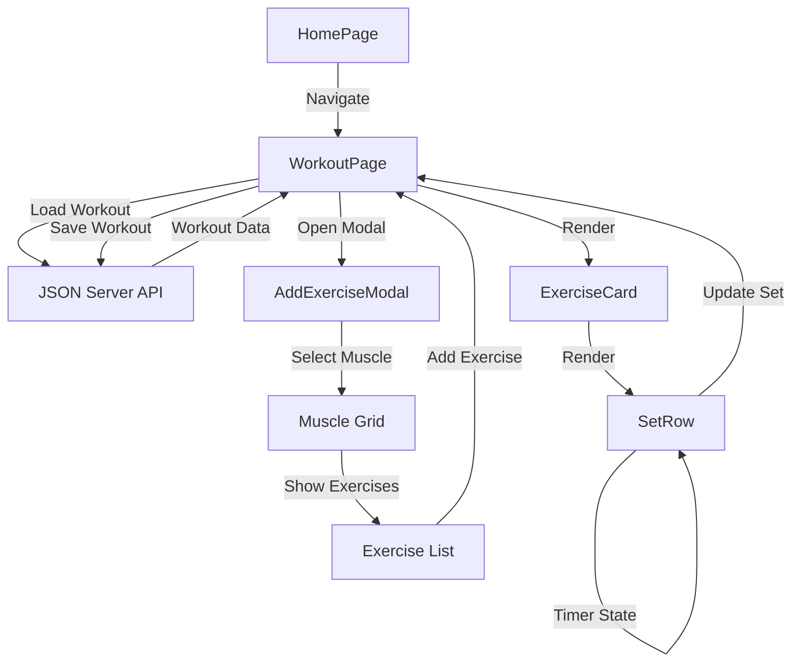
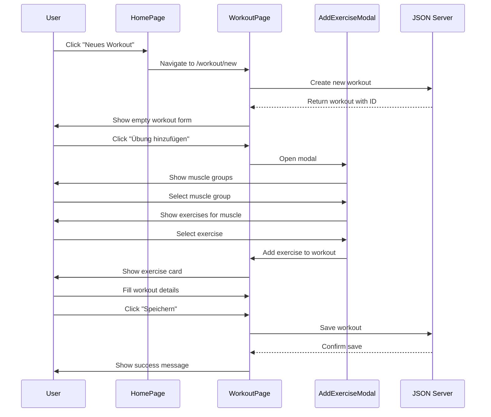
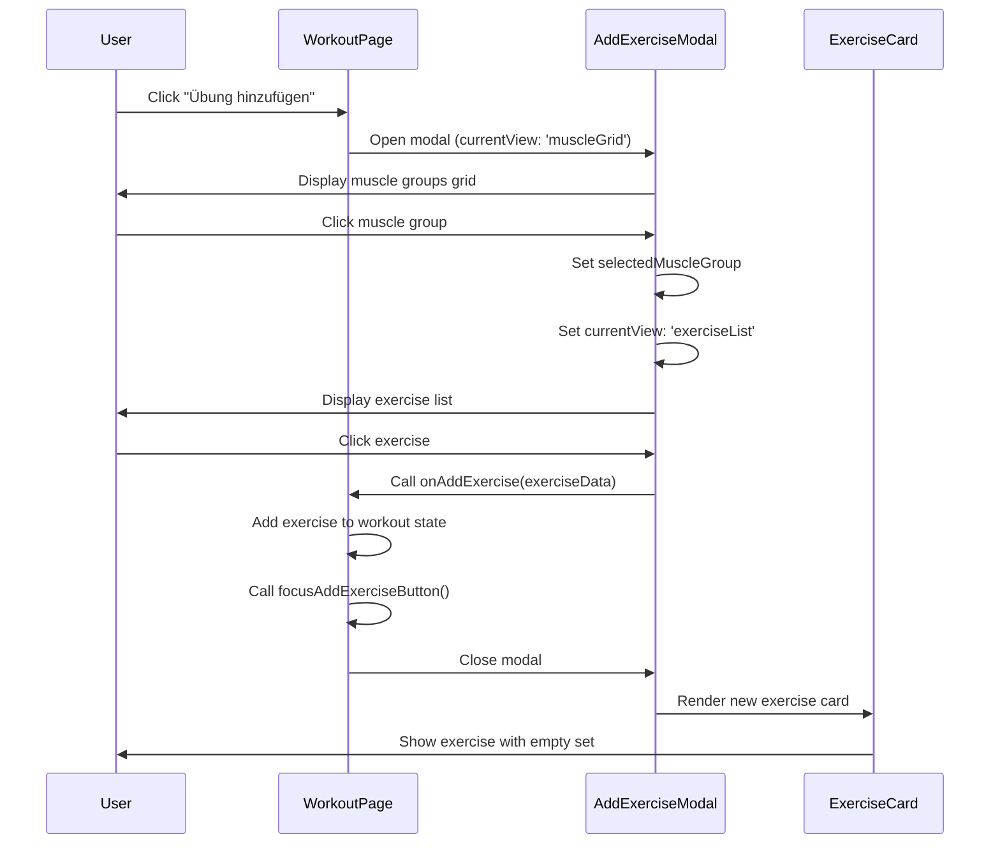
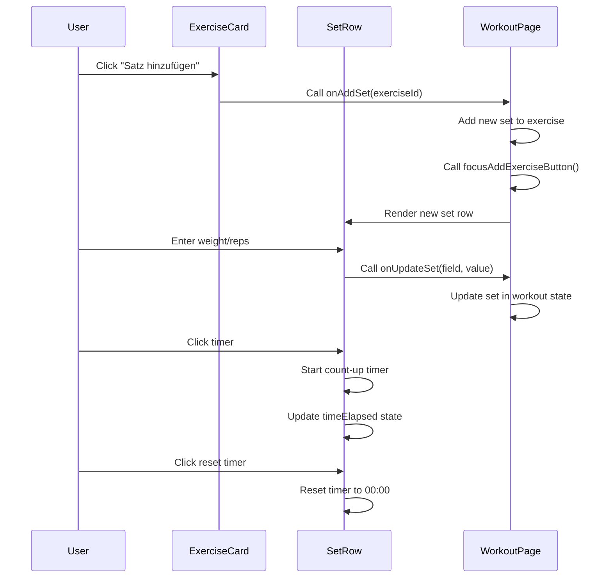
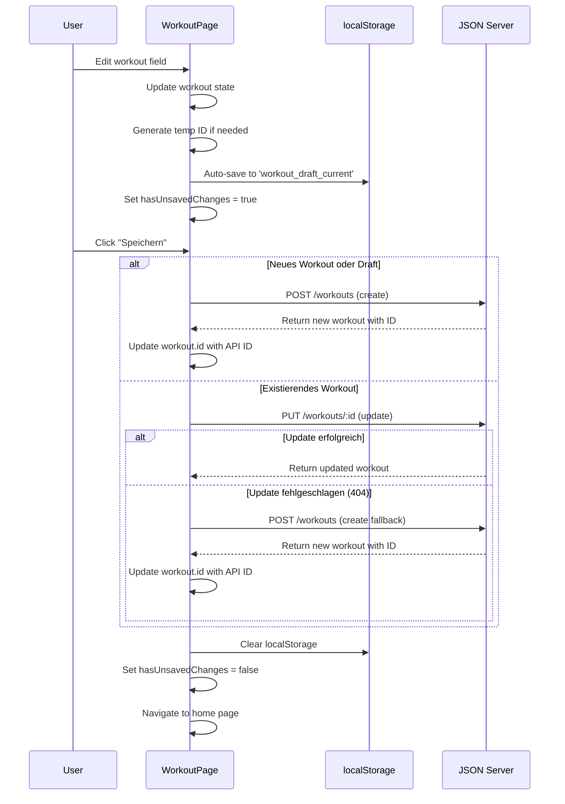
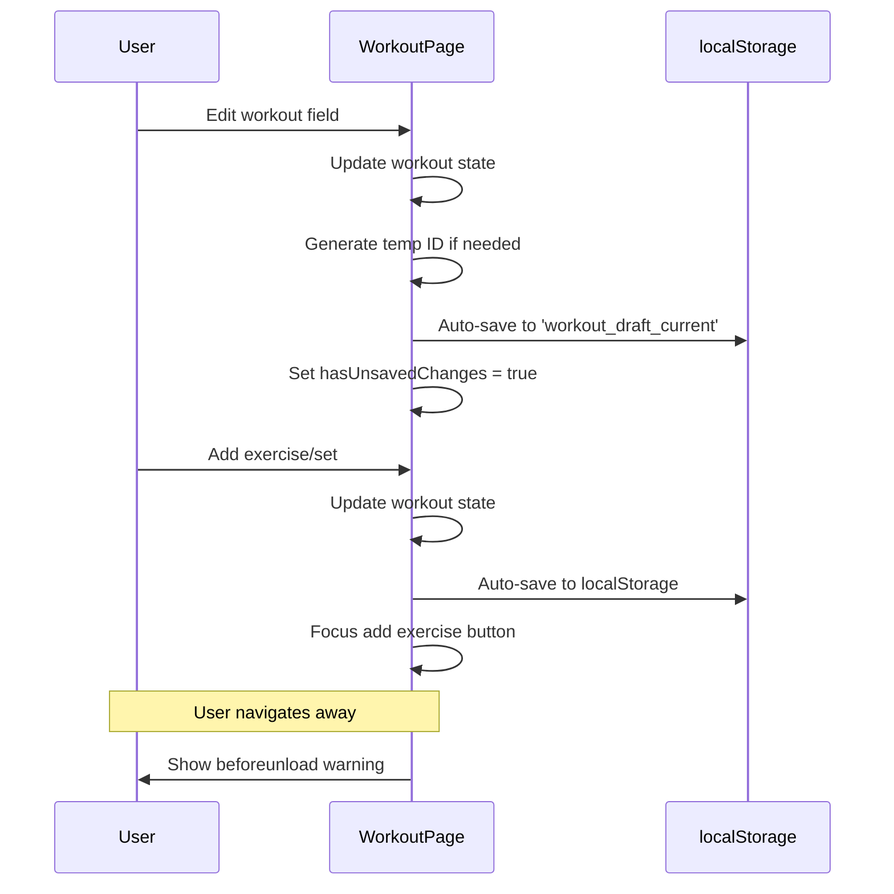
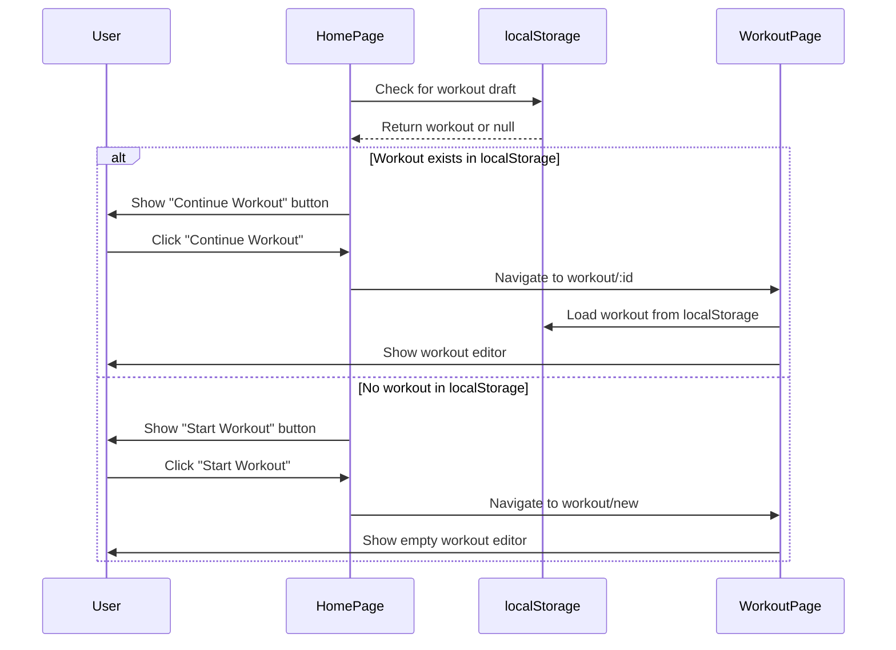
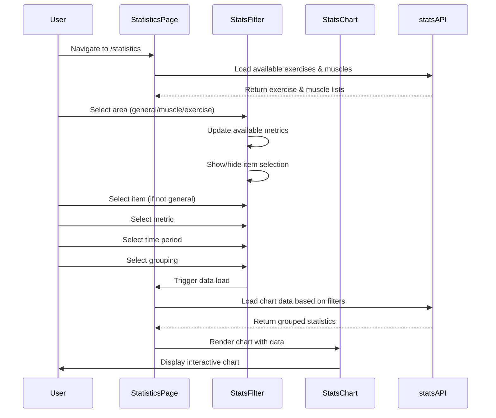
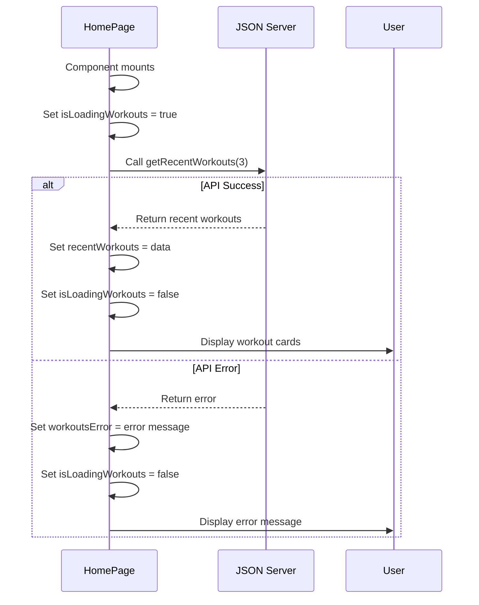

# Workout Tracker - Architecture Documentation

## 📋 Inhaltsverzeichnis
- [Übersicht](#übersicht)
- [Technologie-Stack](#technologie-stack)
- [Projektstruktur](#projektstruktur)
- [Komponentenarchitektur](#komponentenarchitektur)
- [Datenfluss](#datenfluss)
- [Workflows](#workflows)
- [State Management](#state-management)
- [API-Integration](#api-integration)
- [Styling-Architektur](#styling-architektur)

## 🎯 Übersicht

Der Workout Tracker ist eine React-basierte Single-Page-Application (SPA) für die Verwaltung und Durchführung von Workouts. Die Anwendung folgt einer modularen Komponentenarchitektur mit klarer Trennung von Verantwortlichkeiten.

### Hauptfunktionen
- **Workout-Erstellung**: Erstellen und Bearbeiten von Workouts mit Auto-Save
- **Dynamische Übungsauswahl**: Muskelgruppen-Grid mit Übungsdatenbank
- **Übungsverwaltung**: Hinzufügen, Bearbeiten und Löschen von Übungen
- **Satz-Tracking**: Verwaltung von Gewichten, Wiederholungen und Pausenzeiten
- **Timer-Funktionalität**: Count-Up-Timer für Pausenzeiten (startet bei 00:00)
- **Intelligente localStorage Integration**: Robuste Auto-Save mit Fallback-Logik
- **Dynamische Workout-Anzeige**: Letzte 3 Workouts werden automatisch geladen
- **Erweiterte Statistiken**: Hierarchische Filter mit Metriken für Übungen, Muskelgruppen und allgemeine Statistiken
- **Interaktive Charts**: Recharts-basierte Visualisierung mit Tooltips und Responsive Design
- **Responsive Design**: Mobile-first mit dynamischen Kartenbreiten
- **Umfassende Tests**: Unit Tests mit Vitest und React Testing Library

## 🛠 Technologie-Stack

### Frontend
- **React 18** - UI-Framework
- **Vite** - Build-Tool und Development Server
- **React Router** - Client-side Routing
- **Recharts** - Chart-Bibliothek für Statistiken
- **CSS3** - Styling mit CSS Custom Properties

### Backend
- **JSON Server** - Mock API Server
- **Node.js** - Runtime Environment

### Development Tools
- **Vitest** - Test Runner (Vite-basiert)
- **React Testing Library** - Komponenten-Tests
- **ESLint** - Code Linting
- **Prettier** - Code Formatting
- **Git** - Version Control

## 📁 Projektstruktur

```
src/
├── components/           # Wiederverwendbare UI-Komponenten
│   ├── AddExerciseModal/ # Modal für Übungsauswahl (Muskelgruppen-Grid)
│   ├── BottomNavigation/ # Wiederverwendbare Navigation
│   ├── DateDisplay/      # Datumsanzeige-Komponente
│   ├── ExerciseCard/     # Übungskarte mit Sets und Timer
│   ├── SetRow/           # Einzelner Satz mit Count-Up Timer
│   ├── StartWorkout/     # Start-Button mit Continue-Funktionalität
│   ├── StatsChart/       # Recharts-basierte Diagramme
│   ├── StatsFilter/      # Hierarchische Filter-Komponente
│   └── WorkoutCard/      # Wiederverwendbare Workout-Karten
├── config/               # Konfigurationsdateien
│   └── statistics.js    # Metriken-Konfiguration für Statistiken
├── pages/                # Hauptseiten der Anwendung
│   ├── HomePage/        # Dashboard mit dynamischen Workouts
│   ├── PastWorkoutsPage/ # Vergangene Workouts-Übersicht
│   ├── StatisticsPage/   # Erweiterte Statistiken mit Charts
│   └── WorkoutPage/      # Workout-Editor mit Auto-Save
├── data/                 # Statische Daten
│   └── exerciseDatabase.js # Übungsdatenbank mit Muskelgruppen
├── services/             # API Services
│   ├── api.js           # Workout API mit getRecentWorkouts()
│   └── statsAPI.js      # Statistiken API mit hierarchischen Metriken
├── styles/               # Globale Styles
│   └── globals.css      # CSS Custom Properties & Design System
├── test/                 # Test Setup
│   └── setup.js         # Vitest Konfiguration
├── types/                # Datenmodelle und Konstanten
└── utils/                # Utility-Funktionen
    ├── general.js       # localStorage-Funktionen & ID-Generierung
    ├── dateTime.js      # Datum/Zeit Utilities
    ├── validation.js    # Input-Validierung
    └── statistics.js    # Statistik-Berechnungen mit Gruppierung
```

## 🏗 Komponentenarchitektur

### Komponentenhierarchie

```
App
├── Router
│   ├── HomePage
│   │   ├── StartWorkout
│   │   ├── DateDisplay
│   │   ├── WorkoutCard[] (für Recent Workouts)
│   │   └── BottomNavigation
│   ├── WorkoutPage
│   │   ├── AddExerciseModal
│   │   │   ├── MuscleGrid
│   │   │   └── ExerciseList
│   │   └── ExerciseCard[]
│   │       └── SetRow[]
│   ├── StatisticsPage
│   │   ├── StatsFilter
│   │   ├── StatsChart
│   │   └── BottomNavigation
│   └── PastWorkoutsPage
│       ├── WorkoutCard[]
│       └── BottomNavigation
```

### Komponentenverantwortlichkeiten

#### **HomePage**
- **Zweck**: Hauptdashboard mit dynamischer Workout-Übersicht
- **Props**: Keine
- **State**: 
  - `localStorageWorkout` - Aktueller Workout-Entwurf
  - `recentWorkouts` - Letzte 3 Workouts von API
  - `isLoadingWorkouts` - Ladezustand für Workouts
  - `workoutsError` - Fehlerzustand für API-Calls
- **Funktionen**: 
  - Navigation zu WorkoutPage
  - Continue Workout-Funktionalität
  - Dynamisches Laden der letzten Workouts
  - Loading/Error/Empty States

#### **WorkoutPage**
- **Zweck**: Workout-Editor mit Auto-Save und localStorage-Integration
- **Props**: `workoutId` (via Router)
- **State**: 
  - `workout` - Aktuelles Workout-Objekt
  - `isAddExerciseModalOpen` - Modal-Sichtbarkeit
  - `isLoading` - Ladezustand
  - `hasUnsavedChanges` - Ungespeicherte Änderungen-Indikator
- **Funktionen**: 
  - CRUD-Operationen für Workouts und Übungen
  - Auto-Save zu localStorage
  - Fokus-Management für bessere UX
  - beforeunload-Warnung bei ungespeicherten Änderungen

#### **AddExerciseModal**
- **Zweck**: Übungsauswahl über Muskelgruppen
- **Props**: 
  - `isOpen` - Modal-Sichtbarkeit
  - `onClose` - Schließen-Callback
  - `onAddExercise` - Übung hinzufügen-Callback
- **State**: 
  - `currentView` - Aktuelle Ansicht (muscleGrid/exerciseList)
  - `selectedMuscleGroup` - Ausgewählte Muskelgruppe
- **Workflow**: Muskelgruppe → Übungsliste → Übung hinzufügen

#### **ExerciseCard**
- **Zweck**: Darstellung einer Übung mit ihren Sets
- **Props**: 
  - `exercise` - Übungsobjekt
  - `onUpdateExercise` - Update-Callback
  - `onRemoveExercise` - Löschen-Callback
  - `onAddSet` - Satz hinzufügen-Callback
  - `onUpdateSet` - Satz-Update-Callback
  - `onRemoveSet` - Satz-Löschen-Callback
- **State**: Kein lokaler State
- **Funktionen**: Übungsname bearbeiten, Sets verwalten

#### **SetRow**
- **Zweck**: Einzelner Satz mit Count-Up Timer-Funktionalität
- **Props**: 
  - `set` - Satz-Objekt
  - `onUpdateSet` - Update-Callback
  - `onRemoveSet` - Löschen-Callback
- **State**: 
  - `isTimerRunning` - Timer-Status
  - `timeElapsed` - Verstrichene Zeit (Count-Up, startet bei 0)
- **Funktionen**: 
  - Gewicht/Reps/Notizen bearbeiten (leere Strings als Default)
  - Count-Up Timer steuern (Toggle/Reset)
  - Robuste Input-Validierung für numerische Werte

#### **StatsFilter**
- **Zweck**: Hierarchische Filter-Komponente für Statistiken
- **Props**: 
  - `selectedArea` - Ausgewähltes Gebiet (general/muscle/exercise)
  - `selectedItem` - Ausgewähltes Item (Übung/Muskelgruppe)
  - `selectedMetric` - Ausgewählte Metrik
  - `selectedPeriod` - Ausgewählter Zeitraum
  - `selectedGrouping` - Ausgewählte Gruppierung
  - `availableExercises` - Verfügbare Übungen
  - `availableMuscles` - Verfügbare Muskelgruppen
  - `onAreaChange` - Area-Change-Callback
  - `onItemChange` - Item-Change-Callback
  - `onMetricChange` - Metric-Change-Callback
  - `onPeriodChange` - Period-Change-Callback
  - `onGroupingChange` - Grouping-Change-Callback
- **State**: Kein lokaler State
- **Funktionen**: 
  - Dynamische Metrik-Auswahl basierend auf Area
  - Item-Selection nur für muscle/exercise Areas
  - Responsive Layout mit Area-Buttons oben

#### **StatsChart**
- **Zweck**: Recharts-basierte Diagramm-Komponente
- **Props**: 
  - `data` - Chart-Daten
  - `metric` - Aktuelle Metrik
  - `isLoading` - Loading-Status
  - `error` - Error-Status
- **State**: Kein lokaler State
- **Funktionen**: 
  - Interaktive Line-Charts mit Tooltips
  - Responsive Design
  - Dynamische Y-Achsen-Labels basierend auf Metrik
  - Loading/Error States

#### **WorkoutCard**
- **Zweck**: Wiederverwendbare Workout-Karten-Komponente
- **Props**: 
  - `workout` - Workout-Objekt
  - `onClick` - Click-Handler
  - `className` - CSS-Klasse für Styling
  - `exerciseLimit` - Maximale Anzahl angezeigter Übungen
- **State**: Kein lokaler State
- **Funktionen**: 
  - Workout-Header mit Titel und Datum
  - Übungsliste mit Limit
  - Action-Button für Navigation

#### **BottomNavigation**
- **Zweck**: Wiederverwendbare Bottom-Navigation
- **Props**: 
  - `activeTab` - Aktiver Tab
- **State**: Kein lokaler State
- **Funktionen**: 
  - Navigation zwischen Hauptseiten
  - Active-State-Highlighting
  - Fixed Positioning

## 🔄 Datenfluss

### Datenstrukturen

#### **Workout-Objekt**
```javascript
{
  id: string,
  name: string,
  date: string,
  notes: string,
  exercises: Exercise[]
}
```

#### **Exercise-Objekt**
```javascript
{
  id: string,
  name: string,
  muscleGroup: string,
  sets: Set[],
  notes: string
}
```

#### **Set-Objekt**
```javascript
{
  id: string,
  setNumber: number,
  weight: string|number,
  reps: string|number,
  notes: string
}
```

#### **Statistik-Konfiguration**
```javascript
// src/config/statistics.js
{
  AREAS_CONFIG: [
    { value: 'general', label: 'GENERAL' },
    { value: 'muscle', label: 'MUSCLES' },
    { value: 'exercise', label: 'EXERCISES' }
  ],
  METRICS_CONFIG: {
    general: ['totalWorkouts', 'totalExercises', 'avgWorkoutDuration', 'totalVolume', 'avgWorkoutsPerWeek'],
    muscle: ['volume', 'maxWeight', 'totalSets', 'avgReps', 'workoutFrequency'],
    exercise: ['maxWeight', 'volume', 'totalSets', 'avgReps', 'workoutFrequency', 'avgWeight']
  }
}
```

### Datenfluss-Diagramm



## 🔄 Workflows

### 1. Workout-Erstellung Workflow



### 2. Übung hinzufügen Workflow



### 3. Satz-Management Workflow



### 4. Timer-Workflow

```mermaid
stateDiagram-v2
    [*] --> Stopped: Initial state (00:00)
    Stopped --> Running: Click timer button
    Running --> Stopped: Click timer button
    Stopped --> Reset: Click reset button
    Reset --> Stopped: Timer reset to 00:00
    
    note right of Running: Counts up from 00:00
    note right of Reset: Sets timeElapsed to 0
```

### 5. Robuster Speicher-Workflow



### 6. localStorage Auto-Save Workflow



### 6. Continue Workout Workflow



### 7. Statistiken Workflow



### 8. Dynamic Workout Loading Workflow



## 📊 State Management

### Lokaler State (useState)

#### **HomePage State**
```javascript
const [localStorageWorkout, setLocalStorageWorkout] = useState(null);
const [recentWorkouts, setRecentWorkouts] = useState([]);
const [isLoadingWorkouts, setIsLoadingWorkouts] = useState(true);
const [workoutsError, setWorkoutsError] = useState(null);
```

#### **WorkoutPage State**
```javascript
const [workout, setWorkout] = useState({
  id: null, // Wird gesetzt wenn aus API geladen oder erstellt
  name: '',
  date: getCurrentDate(),
  startTime: getCurrentTime(),
  endTime: '',
  exercises: [],
  notes: '',
  isActive: true
});

const [isAddExerciseModalOpen, setIsAddExerciseModalOpen] = useState(false);
const [isLoading, setIsLoading] = useState(false);
const [hasUnsavedChanges, setHasUnsavedChanges] = useState(false);
```

#### **SetRow Timer State**
```javascript
const [isTimerRunning, setIsTimerRunning] = useState(false);
const [timeElapsed, setTimeElapsed] = useState(0);
```

#### **AddExerciseModal State**
```javascript
const [currentView, setCurrentView] = useState('muscleGrid');
const [selectedMuscleGroup, setSelectedMuscleGroup] = useState('');
```

### State-Update-Patterns

#### **Immutable Updates**
```javascript
// Workout update
setWorkout(prev => ({
  ...prev,
  [field]: value
}));

// Exercise array update
setWorkout(prev => ({
  ...prev,
  exercises: prev.exercises.map(exercise =>
    exercise.id === exerciseId
      ? { ...exercise, [field]: value }
      : exercise
  )
}));

// Set array update
setWorkout(prev => ({
  ...prev,
  exercises: prev.exercises.map(exercise => {
    if (exercise.id === exerciseId) {
      return {
        ...exercise,
        sets: exercise.sets.map(set =>
          set.id === setId
            ? { ...set, [field]: value }
            : set
        )
      };
    }
    return exercise;
  })
}));
```

## 🌐 API-Integration

### JSON Server Endpoints

#### **Workouts**
- `GET /workouts` - Alle Workouts abrufen
- `GET /workouts/:id` - Einzelnes Workout abrufen
- `POST /workouts` - Neues Workout erstellen
- `PUT /workouts/:id` - Workout aktualisieren
- `DELETE /workouts/:id` - Workout löschen

#### **API-Call-Pattern**
```javascript
// GET Request
const response = await fetch(`http://localhost:3001/workouts/${workoutId}`);
const workout = await response.json();

// POST/PUT Request
const response = await fetch(`http://localhost:3001/workouts/${workoutId}`, {
  method: 'PUT',
  headers: {
    'Content-Type': 'application/json',
  },
  body: JSON.stringify(workout)
});
```

### Robuste Create/Update-Logik
```javascript
// Intelligente Workflow-Logik mit Fallback
if (!isNewWorkout && workout.id) {
  try {
    // Versuche Update für existierende Workouts
    savedWorkout = await workoutAPI.updateWorkout(workout.id, workout);
  } catch (error) {
    // Falls Update fehlschlägt (404) → Fallback zu Create
    console.log('Update failed, creating new workout:', error.message);
    savedWorkout = await workoutAPI.createWorkout(workout);
    setWorkout(prev => ({ ...prev, id: savedWorkout.id }));
  }
} else {
  // Neues Workout → Create
  savedWorkout = await workoutAPI.createWorkout(workout);
  setWorkout(prev => ({ ...prev, id: savedWorkout.id }));
}
```

### Error Handling
```javascript
try {
  const response = await fetch(url);
  if (!response.ok) {
    throw new Error(`HTTP error! status: ${response.status}`);
  }
  const data = await response.json();
  return data;
} catch (error) {
  console.error('API Error:', error);
  throw error;
}
```

## 🎨 Styling-Architektur

### CSS Custom Properties (Design System)

#### **Farben**
```css
:root {
  /* Primary Colors */
  --primary-color: #3b82f6;
  --primary-hover: #2563eb;
  
  /* Background Colors */
  --background-dark: #0f172a;
  --background-card: #1e293b;
  --background-card-hover: #334155;
  
  /* Text Colors */
  --text-primary: #f8fafc;
  --text-secondary: #cbd5e1;
  --text-muted: #64748b;
  
  /* Status Colors */
  --error-color: #ef4444;
  --success-color: #10b981;
  --warning-color: #f59e0b;
}
```

#### **Spacing & Layout**
```css
:root {
  /* Spacing Scale */
  --spacing-xs: 0.25rem;
  --spacing-sm: 0.5rem;
  --spacing-md: 1rem;
  --spacing-lg: 1.5rem;
  --spacing-xl: 2rem;
  
  /* Border Radius */
  --radius-sm: 0.25rem;
  --radius-md: 0.5rem;
  --radius-lg: 0.75rem;
  
  /* Shadows */
  --shadow-sm: 0 1px 2px 0 rgba(0, 0, 0, 0.05);
  --shadow-md: 0 4px 6px -1px rgba(0, 0, 0, 0.1);
  --shadow-lg: 0 10px 15px -3px rgba(0, 0, 0, 0.1);
}
```

### CSS-Architektur-Prinzipien

#### **1. Komponenten-spezifische Styles**
- Jede Komponente hat ihre eigene CSS-Datei
- Eindeutige CSS-Klassen-Namen mit Präfixen
- Keine globalen Style-Konflikte

#### **2. Responsive Design**
```css
/* Mobile First Approach */
.component {
  /* Mobile styles */
}

@media (min-width: 768px) {
  .component {
    /* Tablet styles */
  }
}

@media (min-width: 1024px) {
  .component {
    /* Desktop styles */
  }
}
```

#### **3. Accessibility**
```css
/* Focus States */
.component:focus {
  outline: 2px solid var(--primary-color);
  outline-offset: 2px;
}

/* High Contrast Support */
@media (prefers-contrast: high) {
  .component {
    border-width: 2px;
  }
}

/* Reduced Motion Support */
@media (prefers-reduced-motion: reduce) {
  .component {
    transition: none;
  }
}
```

## 🔧 Utility-Funktionen

### localStorage-Funktionen (`utils/general.js`)

```javascript
/**
 * Save workout to localStorage for auto-save functionality
 * @param {Object} workout - Workout object to save
 */
export const saveWorkoutToLocalStorage = (workout) => {
  try {
    localStorage.setItem(`workout_draft_${workout.id}`, JSON.stringify(workout));
    console.log('Workout saved to localStorage:', workout.id);
  } catch (error) {
    console.error('Error saving workout to localStorage:', error);
  }
};

/**
 * Load workout from localStorage (only one draft workout at a time)
 * @returns {Object|null} Workout object or null
 */
export const loadWorkoutFromLocalStorage = () => {
  try {
    const key = 'workout_draft_current';
    const saved = localStorage.getItem(key);
    return saved ? JSON.parse(saved) : null;
  } catch (error) {
    console.error('Error loading workout from localStorage:', error);
    return null;
  }
};

/**
 * Get current workout from localStorage (only one workout stored at a time)
 * @returns {Object|null} Current workout or null if none found
 */
export const getCurrentWorkoutFromLocalStorage = () => {
  try {
    for (let i = 0; i < localStorage.length; i++) {
      const key = localStorage.key(i);
      if (key && key.startsWith('workout_draft_')) {
        const workoutData = localStorage.getItem(key);
        if (workoutData) {
          return JSON.parse(workoutData);
        }
      }
    }
    return null;
  } catch (error) {
    console.error('Error getting current workout from localStorage:', error);
    return null;
  }
};

/**
 * Remove workout from localStorage (only one draft workout at a time)
 */
export const removeWorkoutFromLocalStorage = () => {
  try {
    const key = 'workout_draft_current';
    localStorage.removeItem(key);
    console.log('Workout removed from localStorage:', key);
  } catch (error) {
    console.error('Error removing workout from localStorage:', error);
  }
};

/**
 * Check if workout exists in localStorage
 * @param {string} workoutId - Workout ID
 * @returns {boolean} True if workout exists
 */
export const hasWorkoutInLocalStorage = (workoutId) => {
  try {
    return localStorage.getItem(`workout_draft_${workoutId}`) !== null;
  } catch (error) {
    console.error('Error checking workout in localStorage:', error);
    return false;
  }
};
```

## 🧪 Testing-Architektur

### Test-Framework
- **Vitest** - Schneller Test-Runner (Vite-basiert)
- **React Testing Library** - User-Centric Component Testing
- **Jest-DOM** - Zusätzliche DOM-Matcher

### Test-Struktur
```
src/
├── test/
│   └── setup.js              # Vitest Konfiguration
├── utils/
│   └── general.test.js       # localStorage Utility Tests
├── components/
│   ├── StartWorkout/
│   │   └── StartWorkout.test.jsx
│   ├── ExerciseCard/
│   │   └── ExerciseCard.test.jsx
│   └── SetRow/
│       └── SetRow.test.jsx
└── pages/
    └── WorkoutPage.test.jsx  # Integration Tests
```

### Test-Patterns

#### **Unit Tests**
```javascript
// Utility Functions
describe('localStorage Functions', () => {
  test('should save workout to localStorage', () => {
    const workout = { id: '123', name: 'Test' };
    saveWorkoutToLocalStorage(workout);
    expect(localStorage.setItem).toHaveBeenCalledWith(
      'workout_draft_123',
      JSON.stringify(workout)
    );
  });
});
```

#### **Component Tests**
```javascript
// React Components
describe('ExerciseCard', () => {
  test('should render exercise with sets', () => {
    const exercise = { id: '1', name: 'Push-ups', sets: [] };
    render(<ExerciseCard exercise={exercise} />);
    expect(screen.getByText('Push-ups')).toBeInTheDocument();
  });
});
```

#### **Integration Tests**
```javascript
// Page Integration
describe('WorkoutPage', () => {
  test('should open modal and add exercise', async () => {
    renderWorkoutPage();
    fireEvent.click(screen.getByText('+ Übung hinzufügen'));
    expect(screen.getByTestId('add-exercise-modal')).toBeInTheDocument();
  });
});
```

### Mock-Strategien
- **API Mocking**: `vi.mock()` für externe Services
- **Router Mocking**: Mock für `useParams` und `useNavigate`
- **localStorage Mocking**: Mock für Browser APIs
- **DOM Mocking**: Mock für `scrollIntoView` und `focus`

## 📱 Responsive Design

### Breakpoints
- **Mobile**: < 560px (Vertikal gestapelt)
- **Tablet**: 560px - 900px (Kleinere Karten)
- **Desktop**: > 900px (Vollbreite Karten)

### Responsive Techniken
- **CSS `clamp()`**: Dynamische Kartenbreiten
- **Mobile-First**: Progressive Enhancement
- **Flexbox**: Flexible Layouts
- **Touch-Optimierung**: Größere Touch-Targets

### Dynamic Sizing
```css
/* Responsive Kartenbreite */
.home-workout-card {
  width: clamp(250px, 35vw, 320px);
}

/* Responsive Schriftgrößen */
.home-workout-card-title {
  font-size: clamp(0.8rem, 2.5vw, 1rem);
}
```

## 🚀 Performance-Optimierungen

### Code-Splitting
- Lazy Loading von Routen
- Dynamische Imports für große Komponenten

### State-Optimierung
- Minimale Re-Renders durch gezielte State-Updates
- Immutable Update-Patterns
- Effiziente Array-Manipulationen
- localStorage Caching für bessere Performance

### CSS-Optimierung
- CSS Custom Properties für konsistente Werte
- Minimale CSS-Dateien pro Komponente
- Optimierte Selektoren
- CSS `clamp()` für responsive Performance

### Auto-Save Optimierung
- Debounced localStorage writes
- Batch State Updates
- Efficient localStorage key management

## 🔒 Sicherheit

### Input-Validierung
- Client-seitige Validierung für alle Eingaben
- Sanitization von Benutzereingaben
- Type-Checking für alle Props

### API-Sicherheit
- CORS-Konfiguration für JSON Server
- Input-Validierung auf Server-Seite
- Error-Handling ohne sensible Daten

## 📈 Erweiterbarkeit

### Modulare Architektur
- Komponenten können einfach erweitert werden
- Neue Features durch neue Komponenten
- Wiederverwendbare Utility-Funktionen

### Datenmodell-Erweiterung
- Flexible Objektstrukturen
- Backward-Kompatibilität bei Updates
- Einfache Migration von Datenstrukturen

---

*Diese Dokumentation wird kontinuierlich aktualisiert, um Änderungen in der Architektur zu reflektieren.*
